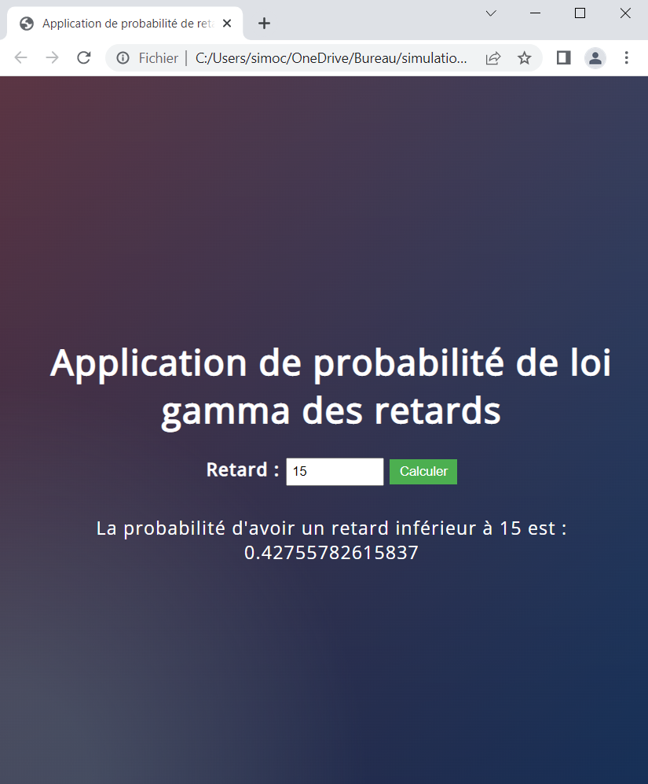
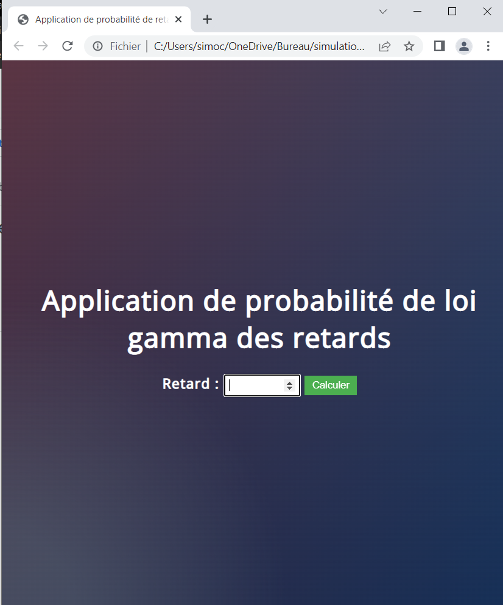

# # Application de simulation des retards d'arrivée des vols

Ce projet consiste en une application permettant de simuler les retards d'arrivée des vols en utilisant la distribution gamma. L'application est développée en utilisant Python, HTML, CSS et JavaScript.

## Étapes de l'analyse des retards de vol  (voir `analyse.pdf`)

1. Lecture du dataset `fly.csv` contenant les données des vols. lien de teléchargement (https://www.kaggle.com/datasets/giovamata/airlinedelaycauses).
2. Préparation des données en sélectionnant la colonne des retards d'arrivée.
3. Suppression des valeurs manquantes dans la colonne des retards d'arrivée.
4. Estimation des paramètres de la loi gamma à partir des données des retards d'arrivée.
5. Visualisation de la distribution gamma estimée en traçant la fonction de densité de probabilité (PDF) et la fonction de répartition (CDF).

## Fonctionnalités de l'application

- Estimation des paramètres de la loi gamma à partir des données du dataset `fly.csv`. lien de teléchargement (https://www.kaggle.com/datasets/giovamata/airlinedelaycauses).
- Génération de nombres aléatoires suivant la distribution gamma estimée.
- Remplacement des valeurs de la colonne des retards d'arrivée dans le dataset avec les valeurs générées.
- Calcul de la probabilité d'un retard d'arrivée donné en utilisant la distribution gamma estimée.
- Interface conviviale avec champ d'entrée pour saisir le retard d'arrivée et affichage de la probabilité calculée.
- Affichage de captures d'écran dans le fichier README pour illustrer l'application.

## Prérequis

- Python 3.x
- Bibliothèques Python : pandas, numpy, matplotlib, scipy
- Navigateur web compatible avec HTML5 et CSS3

## Installation et exécution

1. Clonez ou téléchargez le dépôt du projet sur votre machine.
2. Assurez-vous que les prérequis sont installés.
3. Ouvrez un terminal ou une invite de commandes et accédez au répertoire du projet.
4. Exécutez le fichier `index.html` pour lancer l'application.

## Captures d'écran

*Figure 1: Interface de l'application avec champ d'entrée pour le retard d'arrivée*

### Résultat de la simulation

*Figure 2: Résultat de la simulation avec la probabilité calculée*

## Auteur

jawadoch
